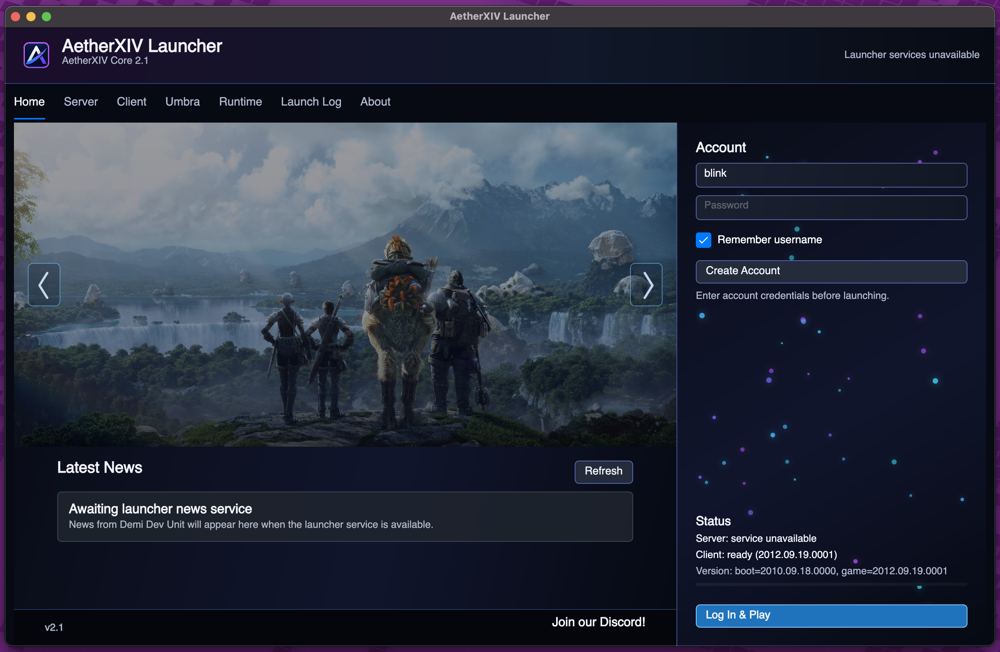
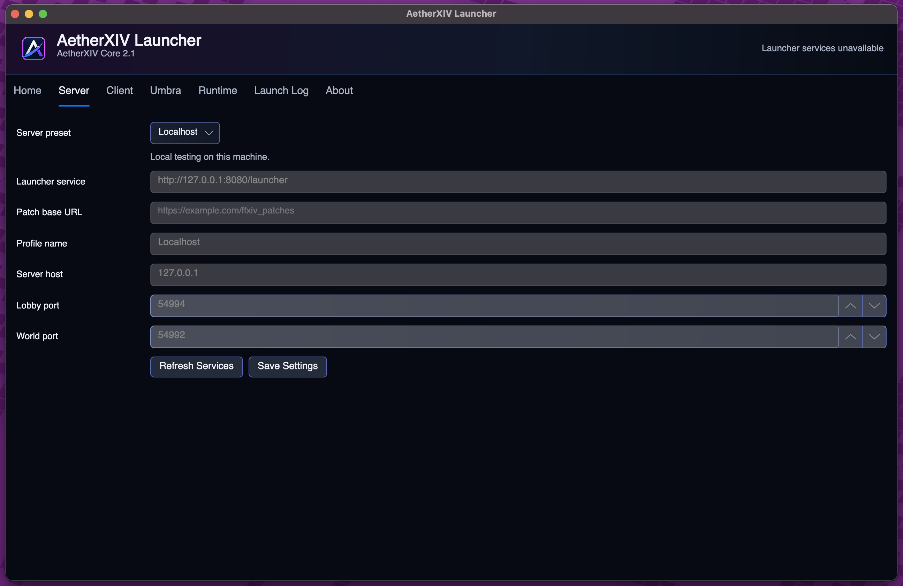
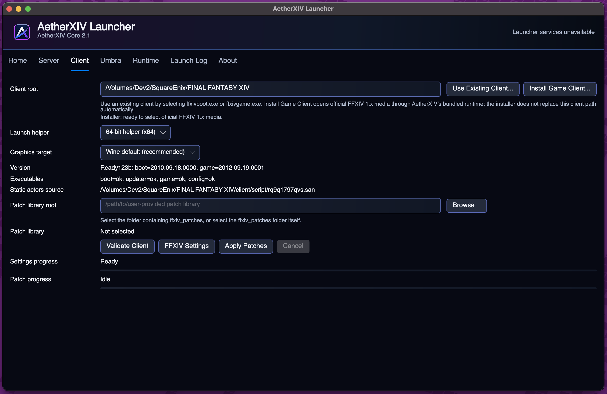
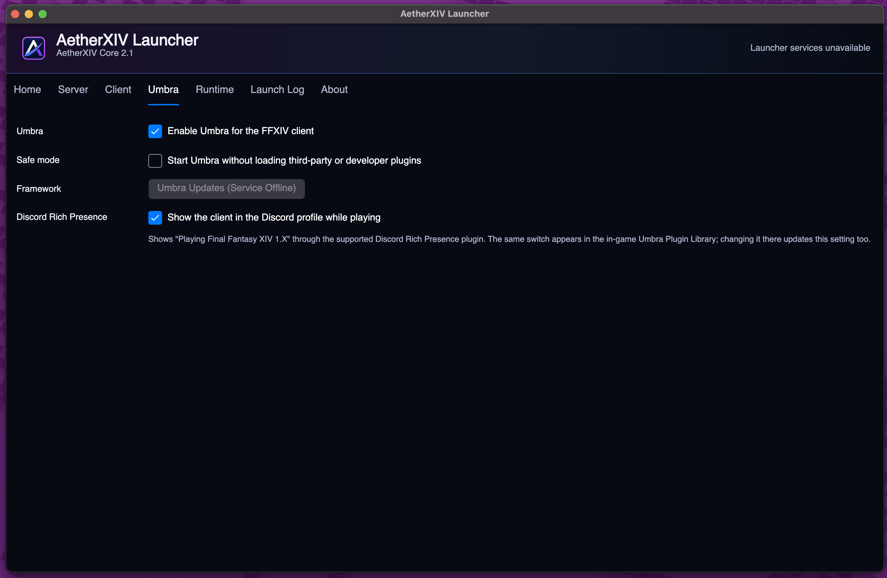
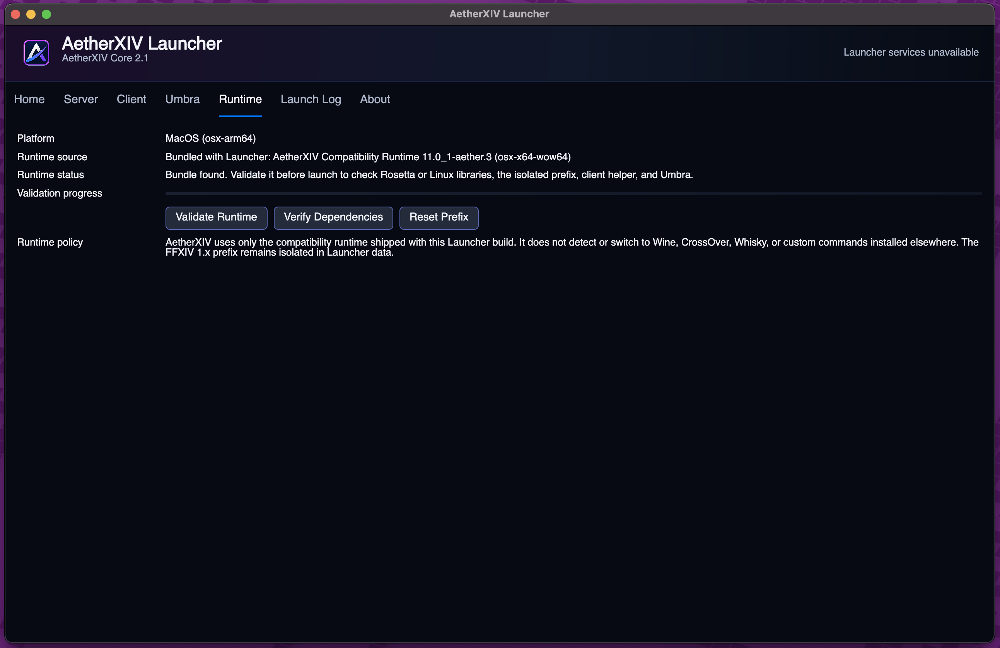
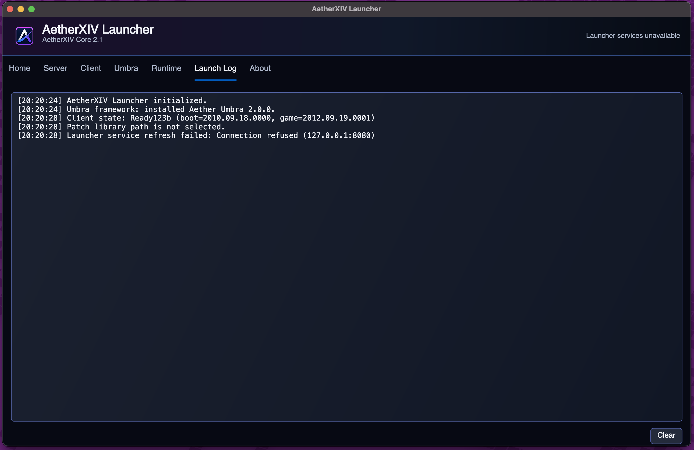

# AetherXIV Launcher Guide

AetherXIV Launcher validates and configures a user-owned Final Fantasy XIV
1.23b client, connects it to an AetherXIV server, manages cross-platform launch
runtimes, and optionally installs Umbra. It is a graphical application and does
not expose a shell or terminal window during normal launch.

## Home

The Home tab is the normal starting point after setup.

- The image reel and its captions come from Launcher Services.
- **Account** accepts the username and password used by the selected server.
- **Remember username** stores only the username. The Launcher does not save the
  account password in its profile.
- **Create Account** is available only when the selected Launcher Service allows
  registration.
- **Status** reports Launcher Services availability, client readiness, and the
  detected boot/game versions.
- **Log In & Play** validates the configuration, authenticates, prepares the
  runtime, selects the launch helper, prepares Umbra when enabled, and starts
  the game.
- **Latest News** is supplied by the configured Launcher Service.

If **Log In & Play** is unavailable or fails, resolve the first failing status
or validation message before changing unrelated settings.

## Server

Choose the destination that owns accounts, news, patches, and game services.

- **Localhost** targets AetherXIV Core on the same computer.
- **Demi Dev Unit Developer Server** uses the maintained developer-service
  preset.
- **Custom Server Setup** unlocks all endpoint fields for another server.

The Launcher Service URL handles account and presentation requests. Patch Base
URL identifies server-provided patch metadata. Server host, Lobby port, and
World port are passed to the client launch workflow.

Select **Refresh Services** to test the configured service, then **Save
Settings**. Preset-controlled values remain locked to prevent accidental drift;
choose the custom preset to edit them.

For a remote server, use an address clients can actually reach. `127.0.0.1`
always means the Launcher's own computer.

For a typical public VPS behind an HTTPS reverse proxy, Launcher Service is the
public URL including its `/launcher` route, for example
`https://launcher.dev.example.com/launcher`. Server host is the public game
hostname without `https://`; Lobby and World use their direct TCP ports. Patch
Base URL can remain empty unless the operator hosts a real patch repository.

## Client

### Select and validate the client

Use **Use Existing Client...** beside Client root and select:

- `ffxivboot.exe` for an unpatched installation; or
- `ffxivgame.exe` after the client has been patched.

The Launcher saves the containing client folder. **Validate Client** checks the
supported version state, required executables, and the static-actors source.
The game must report the supported 1.23b version before launch.

### Open the retail installer

On macOS and Linux, **Install Game Client...** selects the top-level
`ffxivsetup.exe` from official FFXIV 1.x installation media. The Launcher
checks the 32-bit Square Enix bootstrapper, InstallShield product identity,
payload cabinets, and bundled DirectX installer before opening it through the
same compatibility runtime and isolated prefix used by the game.

The Square Enix wizard remains responsible for installation choices. This
button does not download the client, move an existing installation, choose an
installation destination, or replace Client root automatically. Keep client
files outside the Wine prefix so **Reset Prefix** cannot remove them, then use
**Use Existing Client...** to select the installed executable after the wizard
finishes.

### Launch helper

**Automatic** is recommended. Choose x86 or x64 only when diagnosing helper or
runtime compatibility. The helper is not the architecture of the legacy game
itself; Umbra's native bootstrap remains x86.

### Graphics target

- **Wine default** is the recommended cross-platform starting point. It leaves
graphics selection to the runtime; on the pinned compatibility runtime the
legacy DirectX 9 client resolves to WineD3D on OpenGL.
- **OpenGL threaded** is experimental.

The former **OpenGL compatibility** option is no longer offered: on the pinned
runtime it selected the same backend as Wine default, so it was redundant.
Saved profiles that still carry it are treated as Wine default.

Change one graphics target at a time and keep its Launch Log when reporting a
regression.

### Patch library

AetherXIV does not supply Square Enix patches. Select a user-provided folder
containing `ffxiv_patches`, or the `ffxiv_patches` folder itself. Validate the
library before **Apply Patches**. The helper selects the remaining boot and game
patches from the installed version files; older, already completed patch archives
are not required to resume.

Each archive is applied as a recoverable operation. Files replaced or deleted by
the active archive are retained until its contents and version checkpoint commit.
**Cancel** or an apply failure restores that archive's changes. Earlier completed
archives remain installed. After a launcher crash, choose **Apply Patches** again
to recover the interrupted archive before continuing. Keep the client closed
while patching, and do not remove `.aetherxiv-patch-transaction` while it exists.
If a file lock or permissions problem prevents recovery, close the game, correct
the access problem, and retry; the helper keeps the recovery backups.

For failures, retain `.aetherxiv-patch.log` from the client folder and the Launcher
log. The persistent patch log includes the archive, failing file (when available),
exception details, and rollback outcome. A completed patch verifies the files it
changes; it does not reconstruct missing base-install files absent from the patch
archives.

### FFXIV Settings

The settings workflow checks the native or Wine-hosted configuration path
before opening. On macOS/Linux it reuses the same signed runtime-readiness
receipt as game launch; a full validation runs only after a runtime, Launcher,
helper, Umbra, or prefix change, or when **Validate Runtime** is selected.

The **General** tab chooses the language and can create or repair `config.sys`.

The **Graphics** tab controls screen mode, resolution, shadow-map quality,
texture quality, background quality, and frame-rate cap. Existing configuration
files are backed up when settings are saved.

## Umbra

- **Enable Umbra for the FFXIV client** adds the verified framework to the
  launch sequence.
- **Safe Mode** starts Umbra without loading third-party plugins.
- **Umbra Updates (Service Offline)** is intentionally disabled in this build.
  It becomes **Check for Umbra Updates** when the signed Demi Dev Unit service
  is deployed and enabled.

Every 2.1 Launcher package includes its current integrity-pinned Umbra base
framework. Normal game launch selects the newest compatible verified framework,
including the bundled copy, without contacting an update service. Future
downloaded updates will be accepted only when their signed catalog, payload,
and supported client executable identity pass verification. An unknown client
hash blocks injection rather than attempting an unsafe match.

The Launcher does not contain repository URL fields and never installs or
updates plugins. Custom repositories, developer-plugin paths, plugin
installation, and the **Updates** list all belong to the in-game Umbra Plugin
Manager. If the framework update service is unavailable, the Launcher keeps the
last verified compatible framework or its bundled base rather than replacing it
with unverified files.

For plugin installation, capabilities, the developer bridge, and SDK usage,
read the [Umbra SDK](UMBRA_SDK.md).

## Runtime

Windows launches the game natively. macOS, Linux, and SteamOS use this tab to
inspect and validate the compatibility runtime included in the Launcher build.

### Bundled compatibility runtime

The game server is not a runtime package host. AetherXIV uses only the bundled
**AetherXIV Compatibility Runtime** and its complete checksum inventory shipped
with the current Launcher package. It never discovers or switches to Wine
Stable, CrossOver, Whisky, a PATH command, or a custom executable. The Runtime
tab displays the platform, runtime source, runtime status, and validation
progress. Use:

- **Verify Dependencies** to check the selected runtime's platform libraries
  without recreating its prefix;
- **Validate Runtime** to perform a full checksum, platform, prefix, helper,
  and enabled-Umbra probe;
- **Reset Prefix** only when the isolated Wine environment must be recreated.

On the first launch after installation or after a relevant file changes, the
Launcher verifies every runtime checksum and records a versioned readiness
receipt. Later launches compare fast file identities and the prefix generation
marker to that receipt. Wine configuration is also fingerprinted and applied
as one batched operation only when its desired settings change. Manual
validation always performs the complete check.

Validation also checks host prerequisites before Wine starts. On Apple silicon,
the Launcher runs an Intel-process probe that causes macOS to offer its normal
Rosetta installation prompt when Rosetta is absent. The Launcher waits up to ten
minutes for that Apple-managed installation before continuing. It never accepts
the Rosetta license silently. On Linux, validation checks the selected Wine
loader and Wine server with `ldd`, then validates Wine itself and the bundled
launch helper. Wine driver modules are intentionally left to Wine's loader;
probing them directly reports Wine's own `ntdll.so` and `win32u.so` as missing
on otherwise valid distribution installs. Real missing host library names and
distribution-family guidance are shown in the Runtime status and Launch Log.
**Verify Dependencies** offers an explicit
administrator-authenticated install on supported Debian/Ubuntu, Arch, and
Fedora-family systems, then automatically repeats verification. It does not
install anything unless the user accepts the prompt. SteamOS remains on the
persistent-environment guidance path because changing its immutable system
image would not survive an operating-system update.

The default **Wine default** target leaves graphics selection to the bundled
compatibility runtime. On Linux x64, the Launcher may additionally show
**DXVK / Vulkan (validated)** after its cached capability snapshot matches the
runtime payload and a real x86 D3D9 device probe succeeds. The target is hidden
on macOS, Windows, and unsupported Linux architectures. AetherXIV does not
expose a custom Wine command or provider selector.

The 2.1 package uses the bundled compatibility runtime for macOS, Linux, and
SteamOS. Its release branding and exact source revision are recorded in the
`aetherxiv-runtime.json` receipt rather than inferred from a host Wine path.
SteamOS uses the Linux x64 package in persistent Launcher storage. On
Apple silicon, the macOS package contains Intel components and requires
Rosetta. GStreamer is optional on macOS: Wine and the game can launch without
it, but some movies or media may not play. The Launcher reports that warning
without downloading an unsigned installer. A missing runtime or failed
integrity check blocks launch so the matching AetherXIV package can be repaired.

### Reset Prefix

**Reset Prefix** removes the Launcher-managed compatibility environment so it
can be recreated. It can discard Wine-side settings and installed components.
Back up anything important in the managed prefix before using it. It does not
delete the Final Fantasy XIV client folder itself.

## Launch Log

The in-app log shows the current session. **Clear** clears the visible log; it
does not repair the underlying failure.

Persistent Launcher data is stored under `Demi Dev Unit/AetherXIV Launcher` in
the platform application-data folder:

- Windows: `%APPDATA%\Demi Dev Unit\AetherXIV Launcher`
- macOS: `~/Library/Application Support/Demi Dev Unit/AetherXIV Launcher`
- Linux/SteamOS: `$XDG_DATA_HOME/Demi Dev Unit/AetherXIV Launcher`, or
  `~/.local/share/Demi Dev Unit/AetherXIV Launcher`

Important children include `Logs`, `Runtimes`, `RuntimeCache`,
`Prefixes/ffxiv-1x`, and `Umbra/Logs`. A game launch log can have a companion
`.helper.log`. Runtime validation and configuration also write logs here.

See [Debugging and Bug Reporting](DEBUGGING_AND_BUG_REPORTING.md) before sharing
logs or configuration files.
